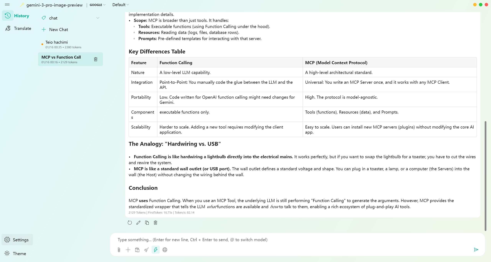
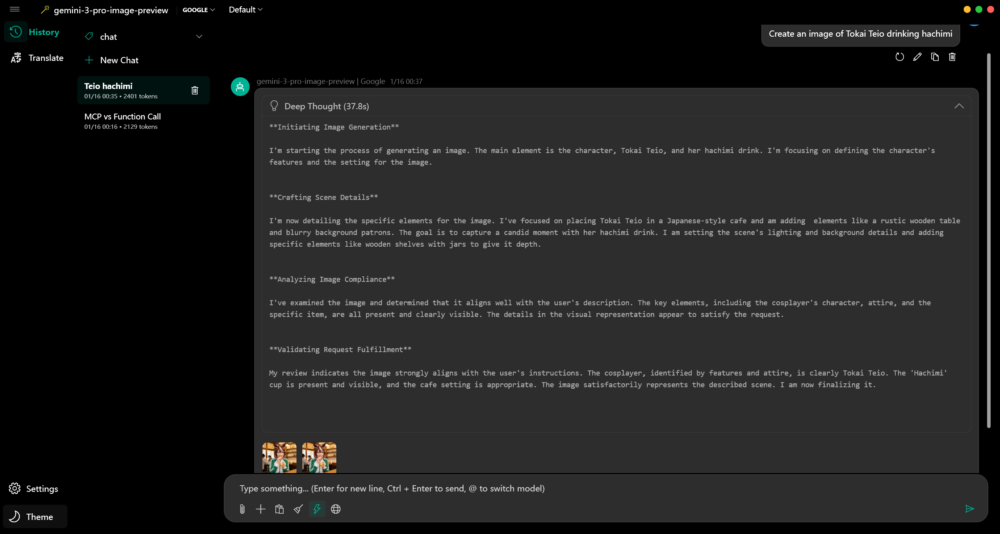
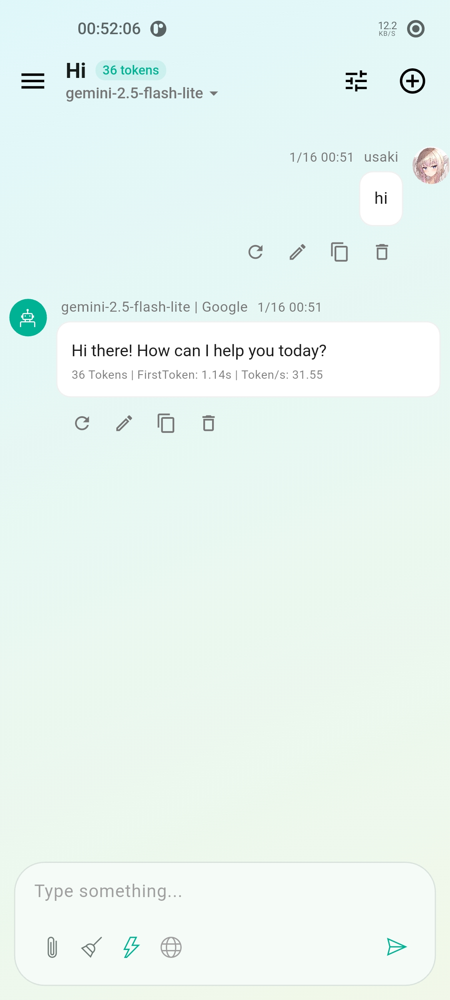
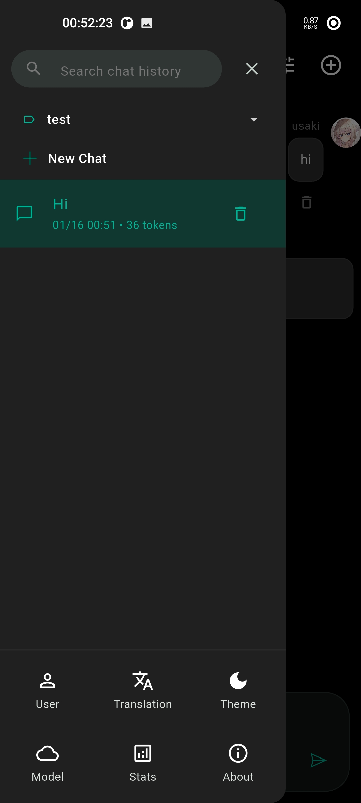

# Aurora

[中文](README_zh.md)

A cross-platform LLM chat client built with Flutter.

## Preview

  
  

  
  

## Platforms

*   **Windows**: Native-like experience with Fluent Design and Mica support.
*   **Android**: Adapted for touch and mobile layouts.

## Features

*   **Multi-Model**: Supports OpenAI, DeepSeek, and custom OpenAI-compatible endpoints.
*   **Privacy**: Chat history and settings are stored locally on the device.
*   **Reasoning**: Displays Chain-of-Thought (CoT) and reasoning processes.
*   **Internet Access**: Built-in web search capability via DuckDuckGo.
*   **Attachments**: Supports image uploads and analysis.
*   **Rendering**: Full Markdown support with syntax highlighting and LaTeX math.
*   **Session Management**: Auto-generates topics for conversations; easy history management.
*   **Interface**: Dark/Light mode, Fluent Design with Mica effect, custom avatars, and streamed responses.
*   **Translation**: Built-in text translation feature powered by LLM.
*   **Preset System**: Customizable prompt presets for different conversation scenarios.
*   **Usage Statistics**: Track token usage, first token time, and response metrics.

## License

MIT License
