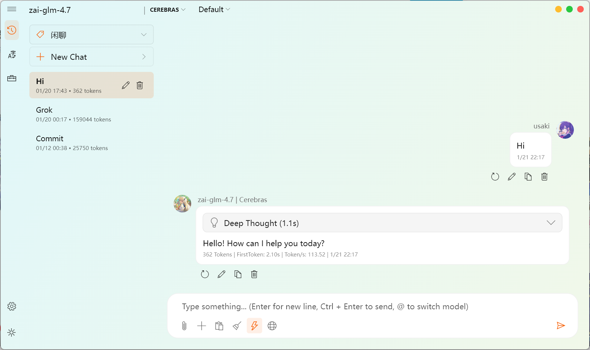
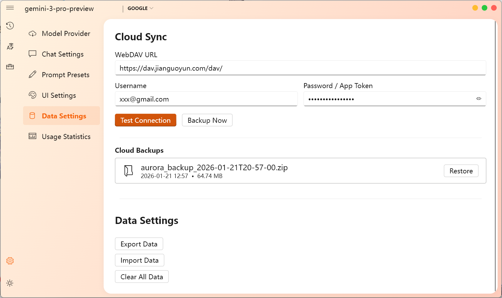
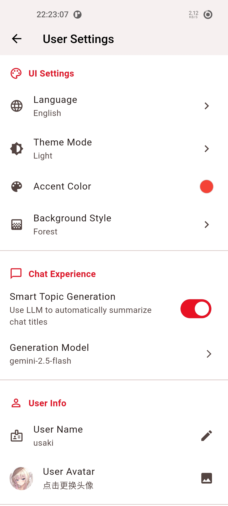
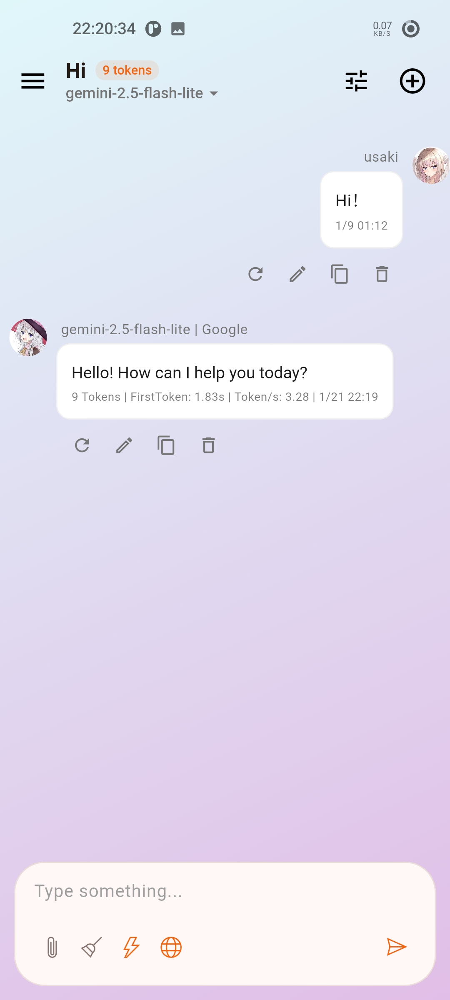

# Aurora

[English](README.md)

基于 Flutter 开发的跨平台 LLM 聊天客户端。

## 预览

  
  

  
  

## 平台支持

*   **Windows**: 适配 Fluent Design 及 Mica 背景效果。
*   **Android**: 适配移动端触控及布局。

## 功能列表

*   **模型支持**: 支持 OpenAI、DeepSeek 及自定义 OpenAI 格式接口。
*   **本地存储**: 聊天记录与配置均存储在本地数据库，数据不经由第三方服务器。
*   **推理展示**: 支持展示模型的深度思考（CoT）过程。
*   **联网搜索**: 内置搜索功能。
*   **附件支持**: 支持图片上传与识别。
*   **内容渲染**: 支持 Markdown、代码高亮及 LaTeX 公式渲染。
*   **会话管理**: 自动生成会话标题，支持历史记录管理。
*   **界面**: 支持深色/浅色模式、自定义背景及强调色，Fluent Design 及 Mica 背景效果，自定义头像，流式输出。
*   **文本翻译**: 内置基于大模型的文本翻译功能。
*   **Studio 模式**: 正在开发中的多 LLM 协作工作模式。
*   **多 Key 轮询**: 支持多个 Key 轮询使用。
*   **多端同步**: 聊天记录和设置可以依赖WebDAV进行多端记录同步。
*   **数据统计**: 可查看 Token 用量和统计数据。
*   **Prompt 预设**: 预设 Prompt 快速切换。

## License

MIT License
