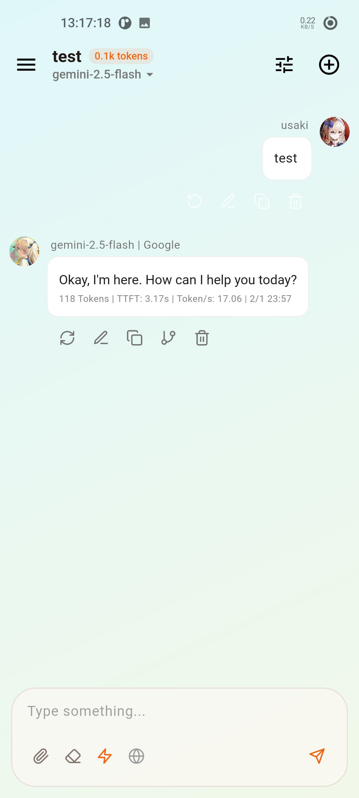
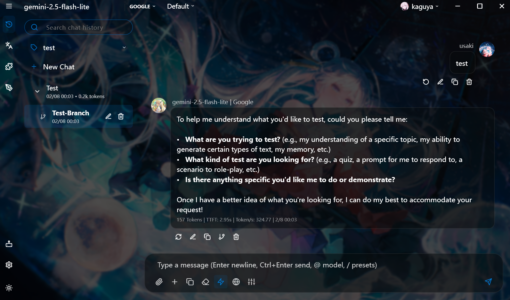
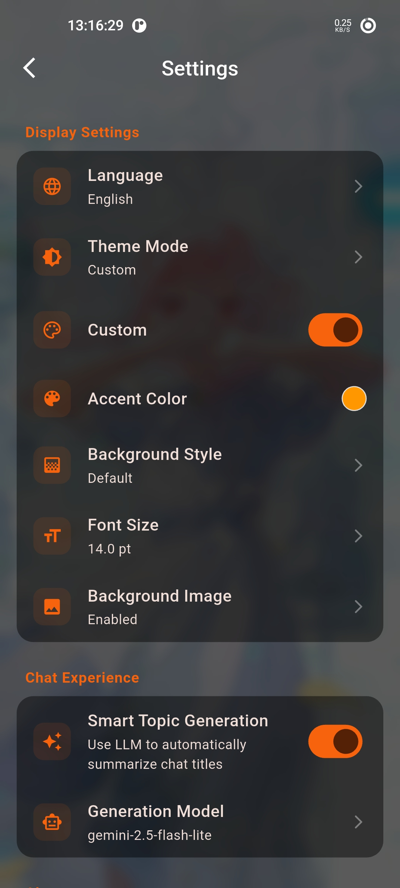
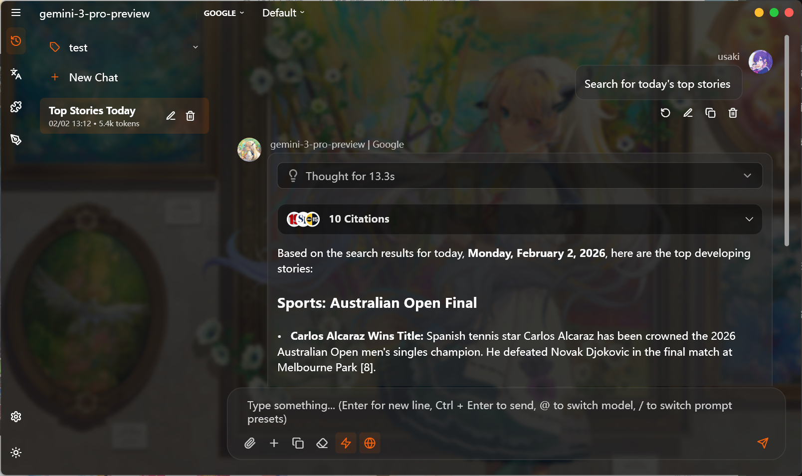

  
  <h1>Aurora</h1>
  
基于 Flutter 开发的跨平台 LLM 聊天客户端。

  <a href="README.md">English</a>

## 预览

  
  &nbsp;&nbsp;&nbsp;&nbsp;
  

  
  &nbsp;&nbsp;&nbsp;&nbsp;
  

## 平台支持

*   **Windows**: 适配 Fluent Design、Mica 背景效果以及原生交互。
*   **macOS**: 适配 macOS 布局及系统特性。
*   **Linux**: 完整桌面端运行支持。
*   **Android / iOS**: 适配移动端触控交互，支持 Bottom Sheet 弹出式 UI。

## 功能列表

*   **模型支持**: 支持 OpenAI、DeepSeek 及自定义 OpenAI 格式接口。
*   **本地存储**: 聊天记录与配置均存储在本地数据库，保护用户隐私。
*   **推理展示**: 支持展示模型的深度思考（CoT）及推理过程。
*   **联网搜索**: 内置联网搜索功能，支持引用内容显示。
*   **附件支持**: 支持图片上传与多模态识别分析。
*   **内容渲染**: 完整支持 Markdown、代码高亮及 LaTeX 公式渲染。
*   **会话管理**: 智能生成会话标题，便捷的历史记录管理。
*   **界面**: 支持深色/浅色模式、自定义背景及强调色，适配视觉反馈。
*   **文本翻译**: 内置基于大模型的实时文本翻译功能。
*   **Studio 模式**: 专为专业创作设计的协作模式（大纲生成、小说写作等）。
*   **技能插件 (Skills)**: 支持通过外部插件（SKILL.md）扩展 AI 能力。
*   **多 Key 轮询**: 自动轮询多个 API Key，提升稳定性。
*   **多端同步**: 支持通过 WebDAV 同步聊天记录和设置。
*   **自定义备份**: 支持可选备份/恢复聊天记录、预设及配置。
*   **数据统计**: 可视化查看 Token 用量和响应性能。
*   **Prompt 预设**: 提供丰富的自定义 Persona 切换支持。

## License

MIT License
