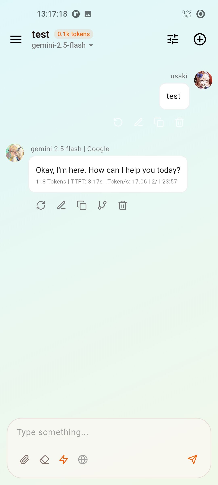
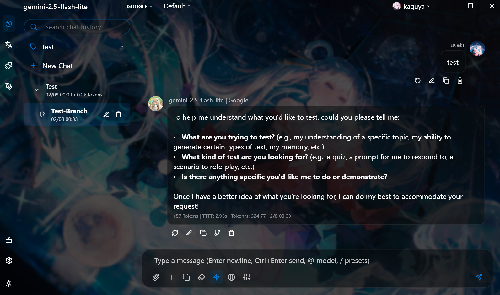

  
  <h1>Aurora</h1>
  
基于 Flutter 开发的跨平台 LLM 聊天客户端。

  <a href="README.md">English</a>

## 预览

  
  &nbsp;&nbsp;&nbsp;&nbsp;
  

  
  &nbsp;&nbsp;&nbsp;&nbsp;
  

## 平台支持

*   **Windows**: 适配 Fluent Design、Mica 背景效果以及原生交互。
*   **macOS**: 适配 macOS 布局及系统特性。
*   **Linux**: 完整桌面端运行支持。
*   **Android / iOS**: 适配移动端触控交互，支持 Bottom Sheet 弹出式 UI。

## 功能列表

*   **多 Provider 与路由**: 支持 OpenAI、DeepSeek、自定义 OpenAI 兼容接口，并支持按模型切换 Gemini Native 传输。
*   **Provider 管理**: 支持多 Provider、模型列表拉取、模型级/全局参数配置，以及多 Key 自动轮询。
*   **本地存储**: 聊天记录与配置均存储在本地数据库，保护用户隐私。
*   **推理展示**: 支持展示模型的思考/推理输出（可用时）。
*   **联网搜索**: 内置联网搜索功能，支持引用内容显示。
*   **MCP 集成**: 支持接入 MCP 服务器（stdio / streamable HTTP），并在对话中直接调用 MCP 工具。
*   **技能插件 (Skills)**: 支持通过本地插件（`SKILL.md`）扩展能力（含 shell/http 工具）。
*   **助手系统**: 支持自定义助手，并可绑定独立提示词与模型/Provider 偏好。
*   **助手记忆**: 支持助手级长期记忆提炼与合并（可选开启）。
*   **知识库 (RAG)**: 支持本地文件导入，结合词法/向量检索注入上下文。
*   **会话工作流**: 支持智能标题、树状历史、会话分支，以及消息级编辑/重试/删除。
*   **输入效率**: 支持 `@` 快速切换模型、`/` 快速切换预设与快捷键发送。
*   **附件支持**: 支持图片、音频、视频及文档上传与多模态识别分析。
*   **内容渲染**: 完整支持 Markdown、代码高亮及 LaTeX 公式渲染。
*   **界面**: 支持深色/浅色模式、自定义背景（支持模糊与亮度调节）、全局透明样式（沉浸式体验）以及强调色适配。
*   **文本翻译**: 内置基于大模型的实时文本翻译功能。
*   **同步与备份**: 支持 WebDAV 同步，以及本地导入导出和可选范围备份/恢复。
*   **数据统计**: 可视化查看 Token 用量和响应性能。
*   **Prompt 预设**: 提供丰富的自定义 Persona 切换支持。
*   **Studio 模式 (开发中)**: 实验性功能区，核心工作流尚未最终定型。

## License

MIT License
